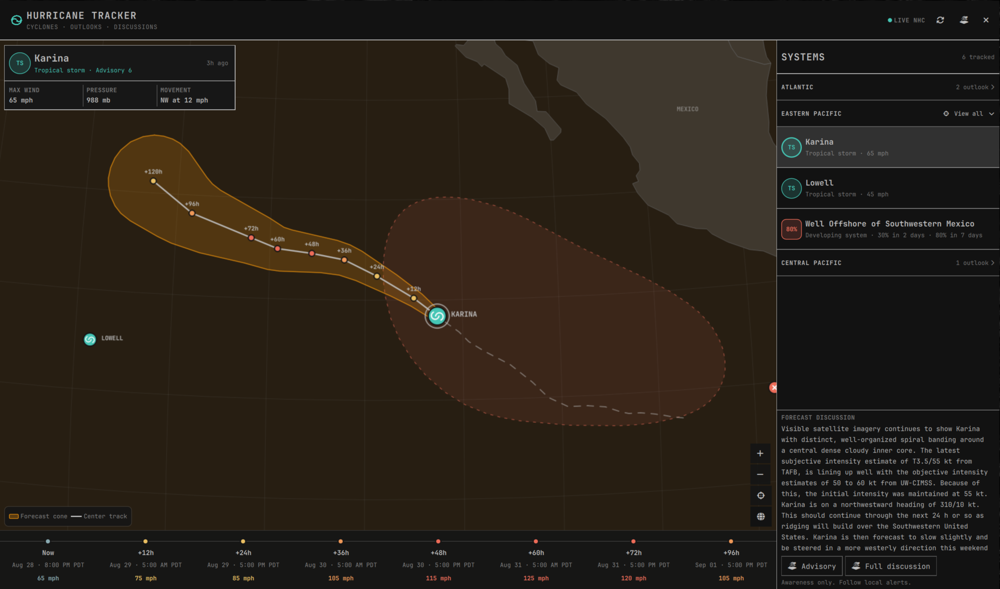

# Hurricane Tracker

Hurricane Tracker adds a tropical-weather icon to your Omarchy bar. Open it to
see what the National Hurricane Center (NHC) is tracking: active storms,
forecast paths, uncertainty cones, and areas that may develop.



The plugin covers the Atlantic, Eastern Pacific, and Central Pacific basins. It
does not currently include storms tracked by the JTWC or other agencies.

## Features

- Active storms and developing systems, grouped by basin
- Official forecast tracks and cones of uncertainty
- Past tracks and intensity history
- Two-day and seven-day formation chances for NHC outlook areas
- Forecast intensity shown with both labels and color
- Excerpts from the latest NHC discussions, with links to the full advisories
- Optional notifications for new cyclones and rising formation chances
- Keyboard navigation, map controls, and support for reduced motion
- Cached data when the NHC is temporarily unavailable

The map is rendered locally in QML using bundled Natural Earth geometry. The
plugin does not need an API key or extra Python packages, and it does not
install a background daemon.

## Install

Hurricane Tracker requires Omarchy Quattro with Quickshell plugin support and
Python 3.

```bash
omarchy plugin add https://github.com/olivoil/omarchy-hurricane-tracker.git --enable
```

Once enabled, open it from `Super+Space` by searching for **Hurricane Tracker**.
The plugin removes its launcher entry when it is disabled or uninstalled.

It also needs HTTPS access to `nhc.noaa.gov` and `www.nhc.noaa.gov` to download
advisories and outlooks.

## Settings and notifications

Hurricane Tracker checks for new NHC data every 15 minutes by default. You can
change the interval in Omarchy's bar settings.

Notifications are off until you choose a region. You can be notified when:

- an outlook area's seven-day formation chance reaches 20%, 40%, or 70%; or
- the NHC begins issuing advisories for a new cyclone.

Alerts can cover the Atlantic, Eastern Pacific, Central Pacific, or all three.
When you turn them on, existing systems are treated as the starting point, so
you will not get a burst of notifications for storms already underway.

## Controls

| Input | Action |
| --- | --- |
| Left-click the bar icon | Open or close Hurricane Tracker |
| Middle-click the bar icon | Refresh NHC data |
| Right-click the bar icon | Open the NHC website |
| Click a system or map marker | Select it and fit it on the map |
| Click a basin heading | Expand or collapse it; expanding also fits it on the map |
| Click **View all** | Fit every system in the expanded basin on the map |
| Drag the map | Move around the globe |
| Mouse wheel | Zoom at the pointer |
| Up / Down | Select the previous or next system |
| `+` / `-` | Zoom in or out |
| `F` | Fit the selected system |
| `G` or `0` | Show the whole globe |
| `R` | Refresh |
| `O` | Open the selected system's official advisory |
| Escape | Close Hurricane Tracker |

## Data and safety

Active storm data comes from the NHC's
[`CurrentStorms.json`](https://www.nhc.noaa.gov/CurrentStorms.json) feed. The
plugin follows the KMZ links in that feed for forecast tracks, cones, and
preliminary best tracks. Formation areas and probabilities come from the NHC's
Graphical Tropical Weather Outlook products. It also fetches the linked text
products for forecast discussion excerpts.

Network requests are limited to NHC-owned HTTPS hosts, and downloads and
expanded archives are size-limited before parsing.

The latest data is cached at `~/.cache/hurricane-tracker/storms.json`. If you
have set `$XDG_CACHE_HOME`, the cache is stored in
`$XDG_CACHE_HOME/hurricane-tracker/storms.json` instead. It contains public
weather data only.

> Hurricane Tracker is an awareness tool, not an emergency warning system. The
> forecast cone shows the probable path of the storm's center; dangerous wind,
> rain, storm surge, and tornadoes can occur well outside it. Follow guidance
> from local authorities and official weather services.

## Update

```bash
omarchy plugin update io.github.olivoil.hurricane-tracker
omarchy restart shell
```

Restarting the shell makes sure the QML interface and data helper are updated
together. Your alert settings and cached NHC data are preserved.

## Uninstall

```bash
omarchy plugin remove io.github.olivoil.hurricane-tracker
```

Omarchy leaves the cached weather data behind. If you want to remove it as
well, delete `~/.cache/hurricane-tracker/storms.json`, or the equivalent file
under your custom `$XDG_CACHE_HOME`.

## Development

Run the full test suite with:

```bash
./tests/run
```

For live development, link the checkout into your Omarchy plugin directory:

```bash
ln -s "$PWD" ~/.config/omarchy/plugins/io.github.olivoil.hurricane-tracker
omarchy-shell shell rescanPlugins
omarchy plugin enable io.github.olivoil.hurricane-tracker center
omarchy-shell shell summon io.github.olivoil.hurricane-tracker '{}'
```

The shell watches the linked directory and reloads saved QML files
automatically. See [`docs/architecture.md`](docs/architecture.md) for an
overview of the data pipeline and UI.

## License

Hurricane Tracker is licensed under the MIT License. The bundled Natural Earth
geometry is public domain; see
[`assets/NATURAL_EARTH.md`](assets/NATURAL_EARTH.md) and
[`THIRD_PARTY_NOTICES.md`](THIRD_PARTY_NOTICES.md) for details.
